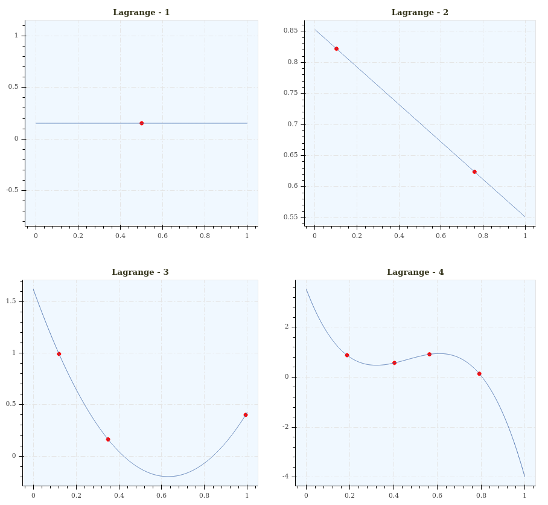
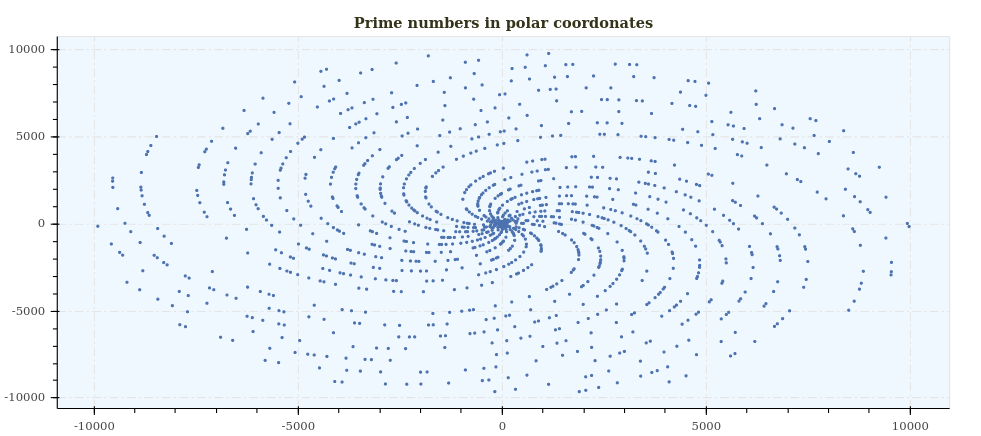
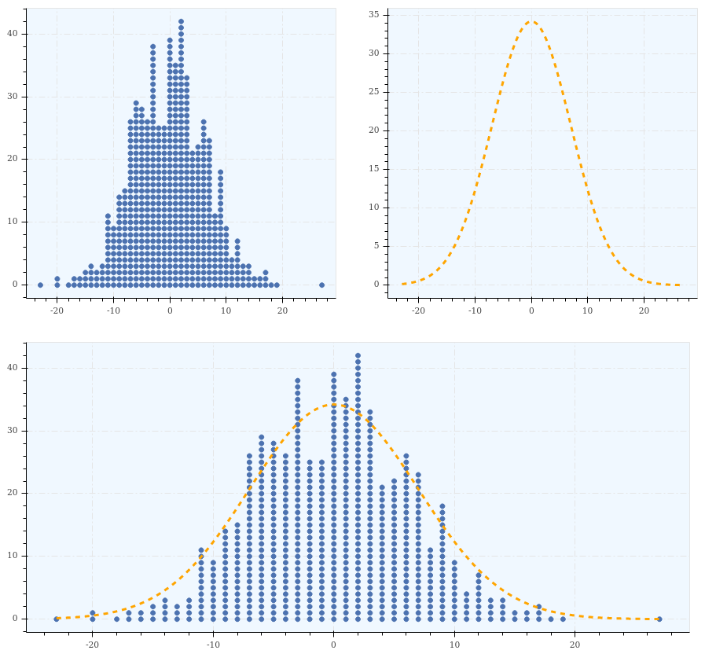

Gallery
=======

::

    import depict
    import numpy as np
    import scipy

    p_all = []
    for i in range(1, 5):
        x = np.random.rand(i)
        y = np.random.rand(i)
        pol = scipy.interpolate.lagrange(x, y)
        p = depict.point(x, y, show_plot=False, color='Red',
                         title='Lagrange - {}'.format(i))
        p += depict.line(x=np.linspace(0, 1, 1000),
                         y=scipy.polyval(pol, np.linspace(0, 1, 1000)),
                         show_plot=False)
        p_all.append(p)
    depict.show(np.reshape(p_all, (2, 2)))

------------

::

    import depict
    import numpy as np

    def is_prime(n):
        if n % 2 == 0 and n > 2:
            return False
        return all(n % i for i in range(3, int(np.sqrt(n)) + 1, 2))

    x = [i * np.sin(i) for i in range(10000) if is_prime(i)]
    y = [i * np.cos(i) for i in range(10000) if is_prime(i)]
    depict.point(x, y, title='Prime numbers in polar coordonates', size=2)

More about the maths here: https://www.youtube.com/watch?v=EK32jo7i5LQ

------------

::

    from collections import Counter
    from itertools import repeat

    import depict
    import numpy as np
    import scipy

    normal = np.round(np.random.normal(size=600, scale=7))
    counter = Counter(normal)

    y = np.concatenate([range(counter[i]) for i in np.arange(normal.min(), normal.max() + 1)])
    x = np.concatenate([list(repeat(i, counter[i])) for i in np.arange(normal.min(), normal.max() + 1)])
    p_point = depict.point(x, y, show_plot=False)

    x = np.linspace(normal.min(), normal.max(), num=1000)
    y = scipy.stats.norm.pdf(x, loc=0, scale=7) * 600
    p_line = depict.line(x=x, y=y, color='Orange', style='-', line_width=3, show_plot=False)

    depict.show([[p_point, p_line], p_point + p_line])
