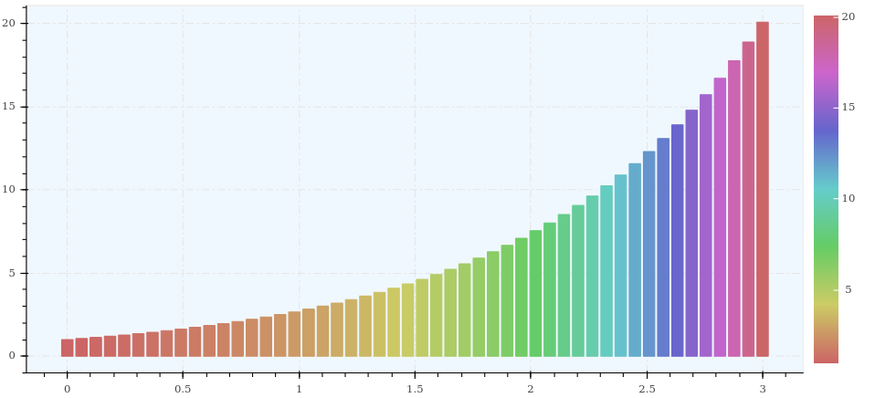
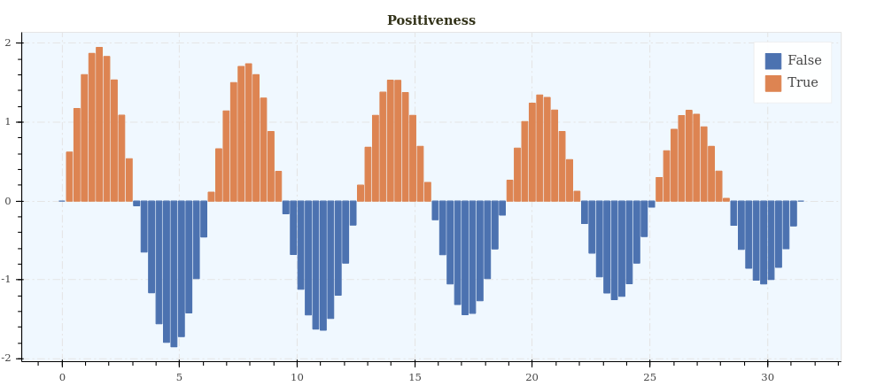

Histogram
=========

Signature
---------

.. autofunction:: depict.histogram

Examples
--------

::

    import depict
    import numpy as np

    x = np.linspace(0, 3)
    y = np.exp(x)
    depict.histogram(x=x, y=y, color=y)

------------

::

    import depict
    import numpy as np

    x = np.linspace(0, 10 * np.pi, 100)
    y = np.sin(x) * np.linspace(2, 1, 100)
    depict.histogram(x=x, y=y, color=y > 0, title='Positiveness')
