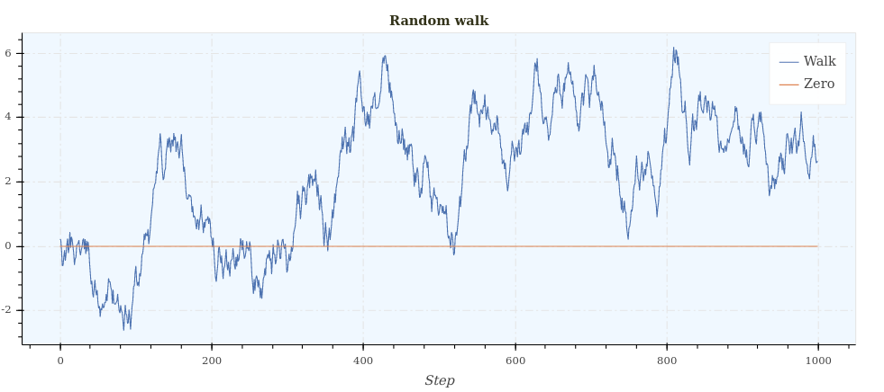
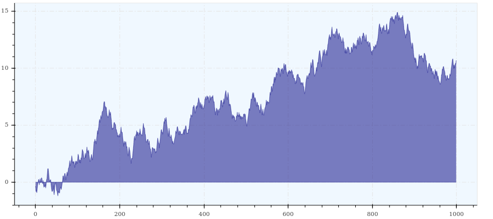
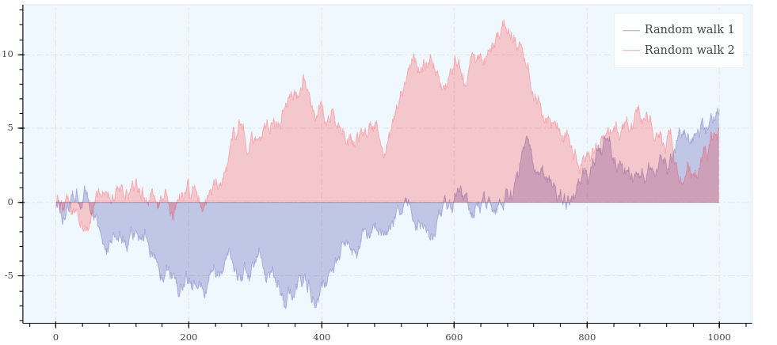
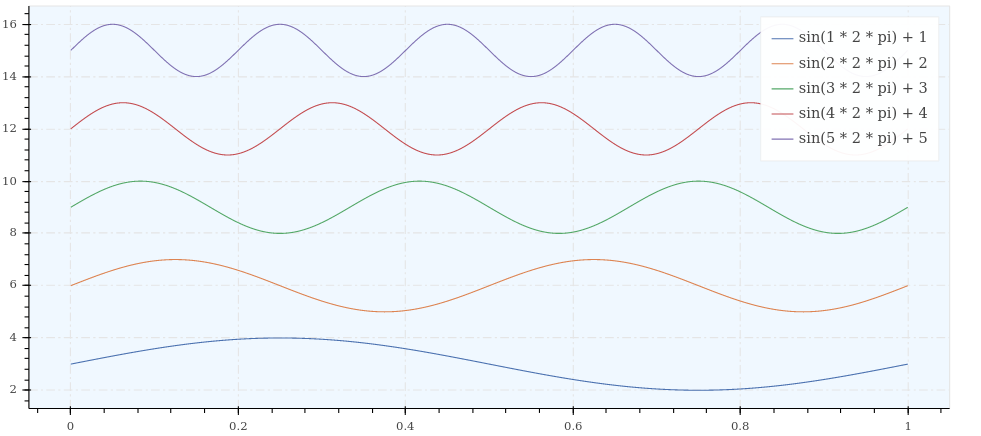

Line(s)
=======

Signature
---------

.. autofunction:: depict.line

Examples
--------

::

    import depict
    import numpy as np

    random_walk = np.cumsum(np.random.rand(1000) - 0.5)
    zero_line = np.zeros_like(random_walk)
    depict.line([random_walk, zero_line], title='Random walk',
                x_label='Step', legend=['Walk', 'Zero'])

::

    import depict
    import numpy as np

    random_walk = np.cumsum(np.random.rand(1000) - 0.5)
    zero_line = np.zeros_like(random_walk)
    depict.line([zero_line, random_walk], fill_between=True, color='navy',
                alpha=0.5)

::

    import depict
    import numpy as np

    random_walk = lambda : np.cumsum(np.random.rand(1000) - 0.5)
    zero_line = np.zeros(1000)
    p = depict.line([zero_line, random_walk()], fill_between=True, color='navy',
                    alpha=0.2, show_plot=False, legend='Random walk 1')
    p += depict.line([zero_line, random_walk()], fill_between=True, color='red',
                     alpha=0.2, show_plot=False, legend='Random walk 2')
    depict.show(p)

::

    import depict
    import numpy as np

    y = [np.sin(i * 2 * np.pi * np.linspace(0, 1, 1000)) + 3 * i for i in range(1, 6)]
    legend = ['sin({} * 2 * pi) + 3 * {}'.format(i, i) for i in range(1, 6)]
    depict.line(x=np.linspace(0, 1, 1000), y=y, color=np.arange(1, 6),
                legend=legend, colorbar_type='categorical')
