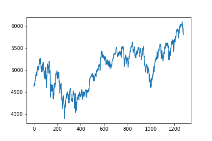
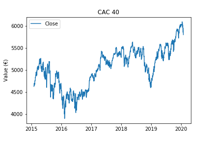
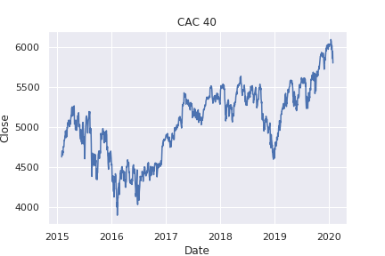
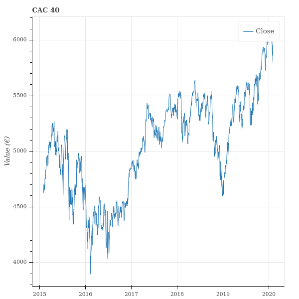
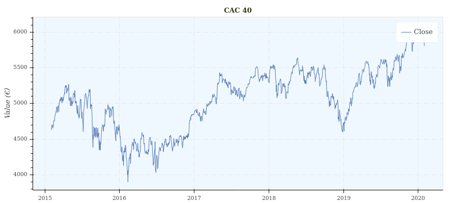

Philosophy
==========

When I approach a data-science problem, I need to plot the data to develop my intuition. I plot graphs – a lot of them.
Few months later, when I come back to this problem, I often find on my disk graph like this:

There are two main problems with this graph: it is not contextualized, and not interactive.

Saving interactive plots from matplotlib seems like a relatively painful hack. Contextualize graph is easy:

::

    import pandas as pd

    # 'https://query1.finance.yahoo.com/v7/finance/download/%5EFCHI?period1=1422835200&period2=1580601600&interval=1d&events=history&crumb=mv7passRdUF'
    df = pd.read_csv('cac40.csv')

    plt.figure()
    dates = pd.to_datetime(df['Date'].values)
    plt.plot(dates, df['Close'].values, label='Close')
    plt.legend()
    plt.title('CAC 40')
    plt.ylabel('Value (€)')
    plt.show()

Even if matplotlib’s API design is remarkable by its capacity to be incredibly
flexible while remaining simple, visualization routine in matplotlib still
requires boiler-plate code.
That’s where seaborn comes in. Seaborn is built on the top of matplotlib and
“provides a high-level interface for drawing attractive and informative
statistical graphics” (seaborn website). Seaborn reduces the verbosity of the
API for usual statistical graphs, while improving their attractiveness. Seaborn
has been a source of inspiration for depict.

::

    import seaborn as sns
    sns.set()

    sns.lineplot(x=pd.to_datetime(df['Date']), y='Close',  data=df).set_title('CAC 40')

Seaborn also brought the idea that a pandas dataframe must be nicely integrated
with a visualization library as it is a standard way of manipulating
time-series in the data-science ecosystem.

The historical data of the french CAC 40 looks nicer but it still can’t be kept
interactive while saved on disk.

Enter Bokeh.

Bokeh is a web based visualization library, first released in April 2013. The
interactive graphs can be saved in a stand-alone html and rendered in the
browser. As a consequence, they can be integrated to emails, Confluence,
web-based reports, etc. I’ve been seduced by this versatility.

::

    from bokeh.plotting import figure, show

    plot = figure(x_axis_type='datetime', title='CAC 40', y_axis_label='Value (€)')
    plot.line(x=pd.to_datetime(df['Date']), y=df['Close'].values, legend_label='Close')
    show(plot)

The graph looks clean while the API is fairly concise and simple.
However, I thought that I would be ready to limit the possibilities with
respect to the graph customization, in order to have an even simpler API. For
example, the fact that we have to create a figure, add elements to it (line,
points, text, etc) and then, in a third step, display it, enables us to combine
graphs together, or display several elements on the same graph. But most of the
time, I want to create a figure, add elements of the same type, and obviously
display it. I wanted to design an API centered on simple visualization
routines. Basically, I wanted to provide a one-line access to the most common
types of graphs. More complex graphs must obviously still be accessible, but
they might require more graph tweaking.

That is where I introduce depict. Depict is built on the top of Bokeh and
essentially, simple graphs can be made simply. The price you pay for that is
the numerous opinionated defaults that are set for you. As an example, you
cannot change the color of the title, or set a different color for the line
around a point and the filling color of this point.

::

    depict.line(x='Date', y='Close', source_dataframe=df, title='CAC 40', y_label='Value (€)')

To by-pass the existence of a figure on which you add elements, I introduced
the sum of graphs. I’ve also tried to guess what the user is trying to achieve
by automatically parsing dates when they are provided as strings for example.
The price for this is that the implementation of all the cases is opaque to the
user. For the dates, the used don’t know if the parsing will consider that the
time-zone is UTC or not. Also, how will the date ‘10/11/12’ be parsed?
Understand dates when they come as strings means that you need to make some
arbitrages that will be mostly hidden to the user. In fact, due to the possible
interaction of various arguments, documenting all the cases is tedious and
would lead to a complicated documentation.

To partially address this issue, I plan to implement a warning system, that
would communicate with the user. For example, when an ambiguous date like
‘10/11/12’ is found, the user should be alerted to explain how it has been
parsed and how he could act on it. The user should be able to deactivate the
warnings for production and also to deactivate only some of them. Some king of
verbosity level in fact.

Depict is still very young. It already contains: several high-level features
(sum of graphs, automatic colorbars, etc), three types of graph (line, point,
histogram), a continuous integration framework based on travis, a documentation
based on Sphinx and hosted on readthedocs.

During the next months, it will include: more types of graphs
(depict.distribution (1 dimensional distributions with kde estimation),
depict.heatmap, depict.boxplot, depict.pie, depict.vertical_line,
depict.horizontal_line, depict.text). The gallery and examples will also grow
along the way.
